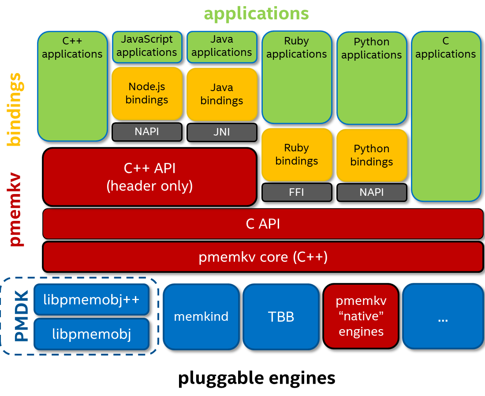

# **pmemkv**

`pmemkv` is a local/embedded key-value datastore optimized for persistent memory.
Rather than being tied to a single language or backing implementation, `pmemkv`
provides different options for language bindings and storage engines.

For more information, including **C API** and **C++ API** see: https://pmem.io/pmemkv.
Documentation is available for every branch/release. For most recent always see (**master** branch):
 * [C++ docs](https://pmem.io/pmemkv/master/doxygen/index.html),
 * [C manpage libpmemkv(3)](https://pmem.io/pmemkv/master/manpages/libpmemkv.3.html).

Latest releases can be found on the ["releases" tab](https://github.com/pmem/pmemkv/releases).

Up-to-date, current support/maintenance status of branches/releases is available on
[pmem.io](https://pmem.io/pmemkv/index.html#releases-support-status).

There is also a small helper library `pmemkv_json_config` provided.
See its [manual](doc/libpmemkv_json_config.3.md) for details.

## Table of contents
1. [Installation](#installation)
2. [Language Bindings](#language-bindings)
    - [C/C++ Examples](#cc-examples)
    - [Other Languages](#other-languages)
3. [Storage Engines](#storage-engines)
4. [Benchmarks](#benchmarks)
5. [Contact us](#contact-us)

## Installation

[Installation guide](INSTALLING.md)
provides detailed instructions how to build and install `pmemkv` from sources,
build rpm and deb packages and explains usage of experimental engines and pool sets.

- [Building from Sources](INSTALLING.md#building-from-sources)
- [Installing on Fedora](INSTALLING.md#installing-on-fedora)
- [Installing on Ubuntu](INSTALLING.md#installing-on-ubuntu)
- [Using Experimental Engines](INSTALLING.md#using-experimental-engines)
- [Building Packages](INSTALLING.md#building-packages)
- [Using a Pool Set](INSTALLING.md#using-a-pool-set)

## Language Bindings

`pmemkv` is written in C/C++ and can be used in other languages - Java, Node.js,
Python, and Ruby.

### C/C++ Examples

Examples for C and C++ can be found within this repository in [examples directory](./examples/).

### Other Languages

The above-mentioned bindings are maintained in separate GitHub repositories, but are still kept in sync with the main `pmemkv` distribution.

* **Java** - https://github.com/pmem/pmemkv-java
* **Node.js** - https://github.com/pmem/pmemkv-nodejs
* **Python** - https://github.com/pmem/pmemkv-python
* **Ruby** - https://github.com/pmem/pmemkv-ruby

## Storage Engines

`pmemkv` provides multiple storage engines that share common API, so every engine can be used with
all language bindings and utilities. Engines are loaded by name at runtime.

| Engine Name  | Description | Experimental | Concurrent | Sorted | Persistent |
| ------------ | ----------- | :-------------: | :-----------: | :-------: | :-------: |
| [cmap](doc/libpmemkv.7.md#cmap) | Concurrent hash map | No | Yes | No | Yes |
| [vsmap](doc/libpmemkv.7.md#vsmap) | Volatile sorted hash map | No | No | Yes | No |
| [vcmap](doc/libpmemkv.7.md#vcmap) | Volatile concurrent hash map | No | Yes | No | No |
| [csmap](doc/ENGINES-experimental.md#csmap) | [Concurrent sorted map](https://pmem.io/libpmemobj-cpp/master/doxygen/classpmem_1_1obj_1_1experimental_1_1concurrent__map.html) | Yes | Yes | Yes | Yes |
| [radix](doc/ENGINES-experimental.md#radix) | [Radix tree](https://pmem.io/libpmemobj-cpp/master/doxygen/classpmem_1_1obj_1_1experimental_1_1radix__tree.html) | Yes | No | Yes | Yes |
| [tree3](doc/ENGINES-experimental.md#tree3) | Persistent B+ tree | Yes | No | No | Yes |
| [stree](doc/ENGINES-experimental.md#stree) | Sorted persistent B+ tree | Yes | No | Yes | Yes |
| [robinhood](doc/ENGINES-experimental.md#robinhood) | Persistent hash map with Robin Hood hashing | Yes | Yes | No | Yes |

The production quality engines are described in the [libpmemkv(7)](doc/libpmemkv.7.md#engines) manual
and the experimental ones are described in the [ENGINES-experimental.md](doc/ENGINES-experimental.md) file.

`pmemkv` also provides testing engines, which may be used in unit tests or for benchmarking application overhead

| Engine Name  | Description | Experimental | Concurrent | Sorted | Persistent |
| ------------ | ----------- | :-------------: | :-----------: | :-------: | :-------: |
| [blackhole](doc/libpmemkv.7.md#blackhole) | Accepts everything, returns nothing | No | Yes | No | No |
| [dram_vcmap](doc/ENGINES-testing.md#dram_vcmap) | Volatile concurrent hash map placed entirely on DRAM | Yes | Yes | No | No |

[Contributing a new engine](CONTRIBUTING.md#creating-new-engines) is easy, so feel encouraged!

## Benchmarks

**Experimental** benchmark based on *leveldb*'s [db_bench](https://github.com/google/leveldb/blob/master/benchmarks/db_bench.cc)
to measure pmemkv's performance is available here:
https://github.com/pmem/pmemkv-bench (previously *pmemkv-tools*).

## Contact us
For more information about **pmemkv**, contact Igor Chorążewicz (igor.chorazewicz@intel.com),
Piotr Balcer (piotr.balcer@intel.com) or post on our **#pmem** Slack channel using
[this invite link](https://join.slack.com/t/pmem-io/shared_invite/enQtNzU4MzQ2Mzk3MDQwLWQ1YThmODVmMGFkZWI0YTdhODg4ODVhODdhYjg3NmE4N2ViZGI5NTRmZTBiNDYyOGJjYTIyNmZjYzQxODcwNDg) or [Google group](https://groups.google.com/group/pmem).
